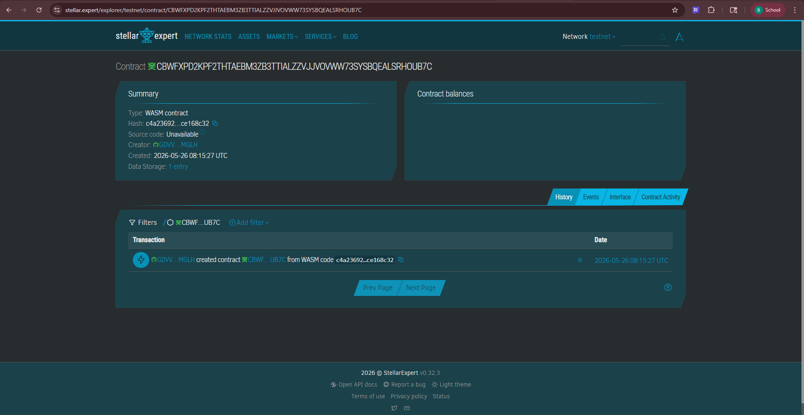

# PaluwaGain

**PaluwaGain** is a Stellar Soroban smart contract for a blockchain-based paluwagan app that records member contributions and automatically releases the pooled payout to the scheduled receiver.

## Problem

A working student in Manila joins a weekly paluwagan with classmates, but payment tracking happens only through group chat, causing confusion, delayed payouts, and disputes when members claim they already paid.

## Solution

PaluwaGain uses Stellar and Soroban smart contracts to collect contributions, lock the payout order, record payments transparently, and automatically release the pooled amount to the correct member once all contributions are complete.

## Timeline

- **Day 1:** Define MVP flow, contract state, and paluwagan rules.
- **Day 2:** Build Soroban contract functions for initialization, deposits, status checks, and payout release.
- **Day 3:** Write unit tests for happy path, duplicate payment failure, state verification, incomplete-round failure, and dashboard status.
- **Day 4:** Build a simple web or mobile-first frontend that calls the contract.
- **Day 5:** Deploy to Stellar testnet and demo a 3-member paluwagan cycle.

## Stellar Features Used

- **XLM / USDC transfers:** Members can contribute using a Stellar token such as USDC or a demo Stellar Asset Contract token.
- **Soroban smart contracts:** The contract stores paluwagan rules, payment status, and payout order.
- **Trustlines:** Real users may need trustlines when using issued Stellar assets such as USDC.
- **Fast low-cost payments:** Stellar makes small repeated paluwagan contributions practical.

## Vision and Purpose

PaluwaGain turns informal rotating savings into a transparent and automated financial coordination tool for Filipino students, dormmates, coworkers, and community groups. The goal is not to replace trust, but to reduce arguments by making contributions and payouts easy to verify.

## Prerequisites

Install:

- Rust stable toolchain
- Stellar CLI / Soroban CLI
- soroban-sdk compatible with version `26.0.0`

Recommended checks:

```bash
rustc --version
stellar --version
```

## How to Build

```bash
soroban contract build
```

Depending on your CLI version, the command may also be:

```bash
stellar contract build
```

## How to Test

```bash
cargo test
```

## How to Deploy to Testnet

Build the contract first:

```bash
soroban contract build
```

Deploy the compiled Wasm to testnet:

```bash
soroban contract deploy \
  --wasm target/wasm32-unknown-unknown/release/paluwagain.wasm \
  --source alice \
  --network testnet
```

If you are using the newer Stellar CLI naming, use:

```bash
stellar contract deploy \
  --wasm target/wasm32-unknown-unknown/release/paluwagain.wasm \
  --source alice \
  --network testnet
```

## Sample CLI Invocation

Example call to initialize a paluwagan group with dummy values:

```bash
soroban contract invoke \
  --id CONTRACT_ID \
  --source alice \
  --network testnet \
  -- initialize \
  --admin ADMIN_ADDRESS \
  --token TOKEN_CONTRACT_ADDRESS \
  --contribution 50000000 \
  --members '["MEMBER_1_ADDRESS","MEMBER_2_ADDRESS","MEMBER_3_ADDRESS"]'
```

Example call for a member deposit:

```bash
soroban contract invoke \
  --id CONTRACT_ID \
  --source member1 \
  --network testnet \
  -- deposit \
  --member MEMBER_1_ADDRESS
```

Example call to release the payout after all members have paid:

```bash
soroban contract invoke \
  --id CONTRACT_ID \
  --source alice \
  --network testnet \
  -- release_payout
```

## License

MIT

## Contract ID
CBWFXPD2KPF2THTAEBM3ZB3TTIALZZVJJVOVWW73SYSBQEALSRHOUB7C

## Link

https://stellar.expert/explorer/testnet/contract/CBWFXPD2KPF2THTAEBM3ZB3TTIALZZVJJVOVWW73SYSBQEALSRHOUB7C


## Screenshot

